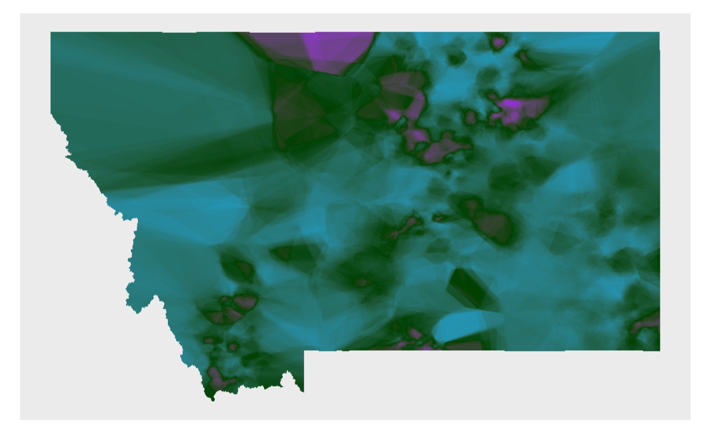

<h2 align='center'> Shale Hunter </h2>

<!-- {width=50%} -->

<h1 align='center'> Welcome to my Github! </h1>

For nearly a decade I have made the natural world a personal, academic, and occupational priority. In June of 2022 I completed my Master’s of Environmental Data Science at UCSB’s Bren School of Environmental Science and Management, but with a dual Bachelors in Biology-Psychology and Chinese from Tufts University, I also have a diverse educational background and a passion for interdisciplinary collaboration and communication. Prior to entering the field of data science, I spent 2 years as a field technician collecting ecological data through the Bureau of Land Management’s <a href='https://gbp-blm-egis.hub.arcgis.com/pages/aim'>Assessment, Inventory, and Monitoring (AIM)</a> protocols in New Mexico and Nevada, which has led to a professional background and interest in desert ecology and botany.

Today I combine my love of nature and data science in my role as Biological Scientist and Data Manager at the Pacifis Southwest Research Station, a part of the United States Forest Service. In my day-to-day work I get to:
<ul>
<li>Work with a talented group of scientists and managers to understand and protect the ecology of the Lake Tahoe Basin.</li>
<li>Collect, summarize and analyze diverse botanical, ecological, and wildlife data in Python, R, and ArcGIS Pro/Online. Lately I've been learing a lot about birds in particular - they're a fascinating part of the web of living things all around us, but unfortunately we're noticing substantial declines in all types of birds living in the Basin. </li>
<li>Present our findings at conferences across the country, in federal reports, and through open science publications. Come back soon to find links to monitoring and management reccomendations as well as data publications for your own exploration!</li>
</ul>
Building off my time as an Ecological Data Specialist with the Montana Bureau of Land Management's AIM program, as well as a stint as Data Management Fellow with the <a href='https://edirepository.org/'>Environmental Data Initiative</a> developing workflows to preserve and disseminate data from watersheds damaged by mine runoff and agriculture, I also strive to ensure that programatic analysis and reporting (using Quarto, RMarkdown, Jupyter Notebooks, and Google Collab) are available to as many of my coworkers as possible, regardless of coding ability.  

If any of my projects or work sound interesting, or you think my skills would be of help on a project of yours, reach out! I am always looking for new environments in which to apply my passion for open science, FAIR data, and inclusivity in data science.

<!--
<li>Integrate Remote Sensing data with in-situ data using tools like Google Earth Engine</li>
- 🧠 I’m currently learning ...
-🏝 I’m currently working on ...
- 👯 I’m looking to collaborate on ...
- 🤔 I’m looking for help with ...
- 💬 Ask me about ...
- 📫 How to reach me: ...
- 🍰 I'd rather be ...
-->
